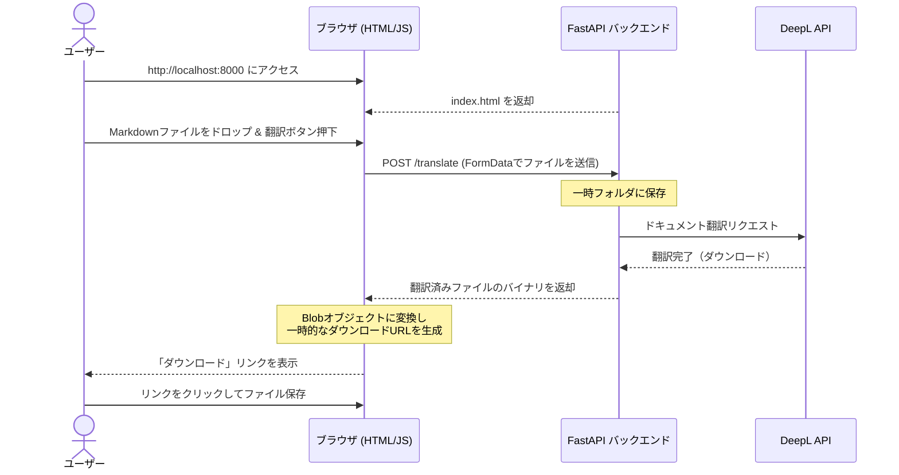

```mermaid
sequenceDiagram
    actor User as ユーザー
    participant Browser as ブラウザ (HTML/JS)
    participant API as FastAPI バックエンド
    participant DeepL as DeepL API

    User->>Browser: http://localhost:8000 にアクセス
    API-->>Browser: index.html を返却
    User->>Browser: Markdownファイルをドロップ & 翻訳ボタン押下
    Browser->>API: POST /translate (FormDataでファイルを送信)
    Note over API: 一時フォルダに保存
    API->>DeepL: ドキュメント翻訳リクエスト
    DeepL-->>API: 翻訳完了（ダウンロード）
    API-->>Browser: 翻訳済みファイルのバイナリを返却
    Note over Browser: Blobオブジェクトに変換し<br/>一時的なダウンロードURLを生成
    Browser-->>User: 「ダウンロード」リンクを表示
    User->>Browser: リンクをクリックしてファイル保存
```
